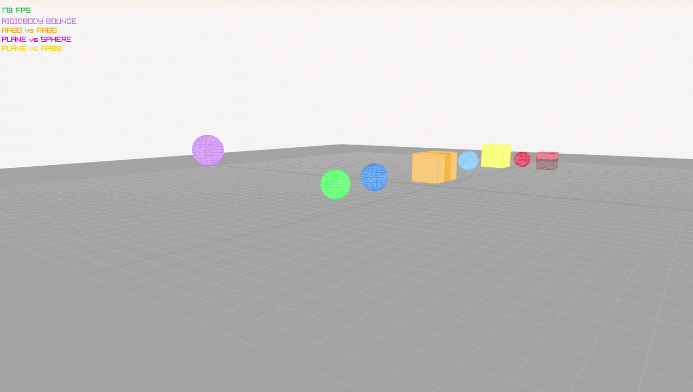

# phyX



phyX is a small 3D rigid-body physics sandbox written in C++20. It simulates linear and rotational motion, detects collisions between primitive shapes, and renders the scene with [raylib](https://www.raylib.com/).

> **Work in progress:** phyX is an experimental project. The included demo and collision solver are intended for exploration, not production use.

## Current features

- **Rigid-body motion** with gravity, linear and angular momentum, quaternion orientation, and shape-based inertia.
- **Collision detection** for sphere–sphere, sphere–AABB, sphere–OBB, AABB–AABB, AABB–OBB, and OBB–OBB pairs, plus sphere, AABB, and OBB collisions against planes.
- **Contact resolution** using restitution, friction, rolling resistance, up to four contact points per pair, cached impulses between steps, and a 10-pass sequential impulse solver.
- **3D debug view** with shaded and wireframe shapes, body axes, a grid, and an FPS counter.
- A demo scene with spheres, rotating boxes, and plane boundaries.

## Build and run

Requirements: CMake 3.14 or newer and a C++20 compiler. CMake downloads raylib 5.5 during the first configuration, so that step needs network access.

```sh
cmake -S . -B build
cmake --build build --config Debug
```

Run the executable from the build directory:

```sh
# Linux / macOS, or single-configuration generators such as Ninja
./build/phyX

# Windows with Visual Studio
.\build\Debug\phyX.exe
```

For a different configuration, replace `Debug` with `Release` in the Windows executable path.

## Demo controls

| Input | Action |
|---|---|
| Hold right mouse button and move mouse | Orbit the camera |
| Hold right mouse button + W / A / S / D | Move the camera |
| Hold right mouse button + Q / E | Move down / up |
| Scroll wheel | Zoom |

The simulation advances at a fixed 120 steps per second; rendering runs independently.

## Project layout

```text
src/
├── main.cpp                  # Demo scene and main loop
├── Engine.h / Engine.cpp     # Body creation, collision detection, and resolution
├── Math/
│   ├── Vector.h              # Vec3 operations
│   ├── Quaternion.h          # Orientation and rotation operations
│   └── Mat3.h                # 3×3 matrix math
├── core/
│   ├── RigidBody.h / .cpp    # Motion state and integration
│   ├── Inertia.h             # Primitive-shape inertia calculations
│   └── IntersectionData.h    # Contact manifold data
├── colliders/                # Sphere, AABB, OBB, and plane tests
├── utils/
│   ├── BodyDesc.h            # Body creation parameters
│   ├── Shape.h               # Shape variants
│   ├── Contact.h             # Body-pair contact data
│   └── Visualizer.h / .cpp   # raylib debug rendering and camera
└── tests/
    └── MathTests.cpp         # Console math sanity checks
```
